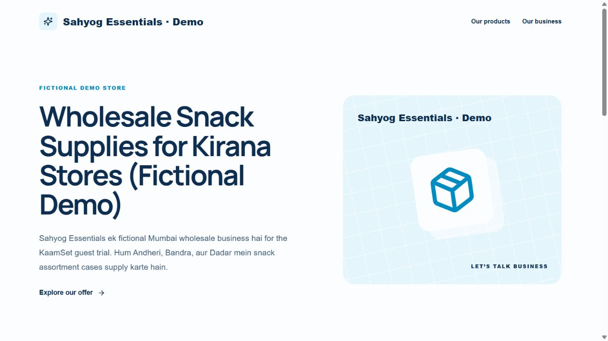
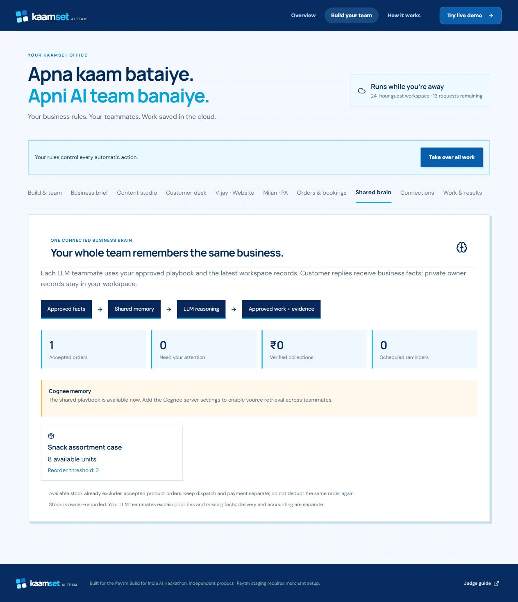
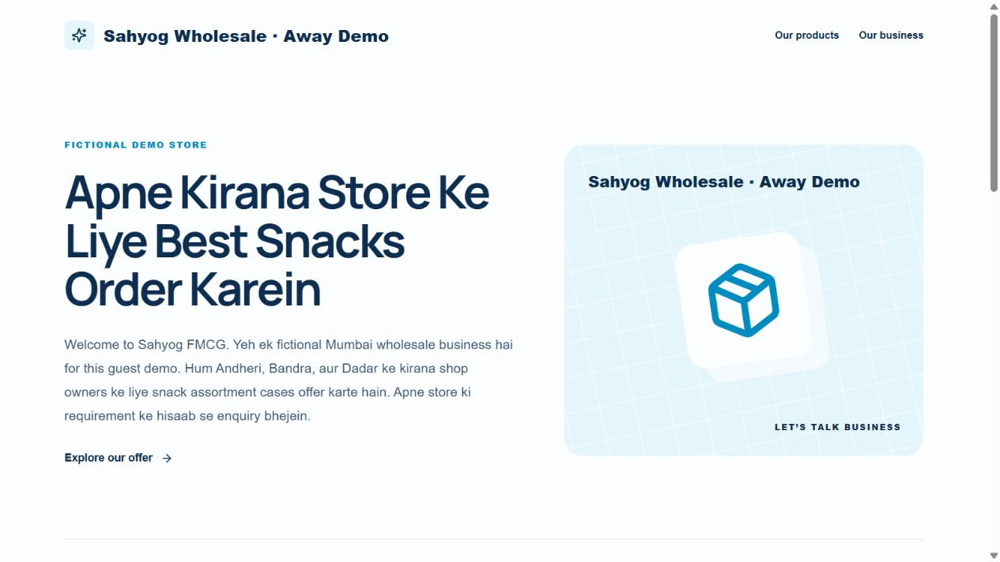
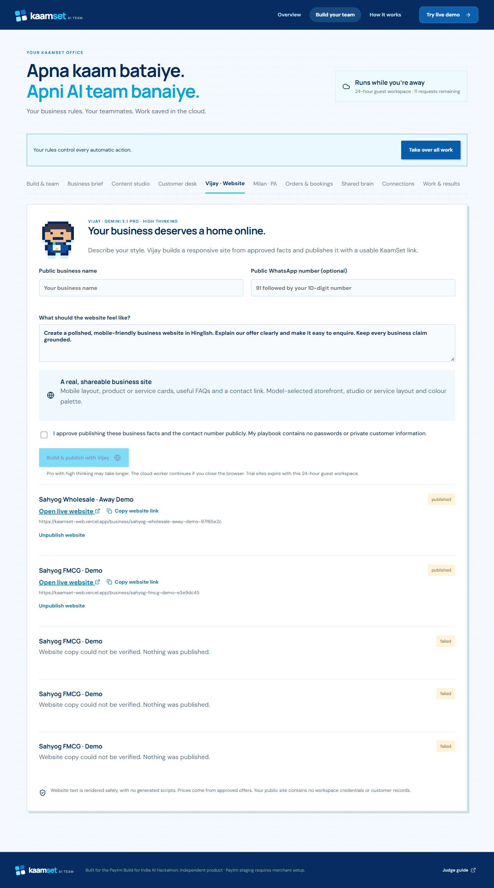

# Live release evidence — 2 October 2026

## Public app and website

- App: https://kaamset-web.vercel.app
- Published fictional Vijay sample: https://kaamset-web.vercel.app/business/sahyog-essentials-demo-fec8c452
- Sample expires with its guest workspace on 3 October 2026 at 2:21 pm IST.
- Actual cloud Gemini 3.1 Pro HIGH created the sample, using approved fictional copy and ₹1,200 offer facts.
- Browser checks at phone and desktop widths showed readable layouts and no horizontal overflow.

## Merchant-to-customer quote journey

The merchant interface saved an approved fictional offer at ₹1,200 per case, minimum two, recorded stock ten and delivery fee ₹0. The order desk generated a signed quote link and QR. The customer page displayed ₹2,400 and required explicit acceptance of the exact quote and terms. The cloud worker confirmed the product order. Reopening the merchant workspace restored one accepted order and eight recorded cases in its shared brain. Verified collections remained ₹0 and Paytm remained setup_needed. No fulfilment or real payment occurred.

The separate API journey accepted the same quote twice and reserved stock once. A second guest could not read the first workspace or control its teammate. Public website projection omitted private bearer, blueprint and source quotes.

## Owner control and model limits

The merchant interface's Take over all work action displayed the owner-control state; Resume AI team released it. Approved facts and cloud records survived closing and reopening the merchant tabs.

The UI created and activated Vijay, but two additional website attempts failed while the first sample remained published. Provider probes reported intermittent HTTP 429. These failures are preserved rather than labelled successes. Backend PR #263 is deployed as a876de39 on both API and worker. It supplies private-safe failure reasons, bounded ordinary Flash planning and the configured timeout, preserving Pro HIGH for websites. Its Foundation release checks passed: TypeScript, 2,388 unit tests, production image/assets, migrations, 75 PostgreSQL journeys, 19 database gates and zero production vulnerabilities.

A new persisted stock task returned a completed model response rejected by strict validation, while a separate builder attempt returned provider_busy. PR #264, merged and approved as 98572eb0, aligns provider output constraints with existing validators and adds bounded, value-free validation diagnostics. Both services are SUCCESS. Full CI passed 2,389 unit tests, 75 PostgreSQL journeys, 19 database gates, production image/assets and zero production vulnerabilities.

The fresh persisted stock task then completed, but its narrative suggested subtracting the accepted order twice. PR #265 clarifies current available balance and atomic reservation semantics in the shared brain and model prompt. Its actual in-memory stock probe retained eight cases and explicitly rejected a second deduction. The impossible-demand blueprint correctly returned needs_scope_change and blocked activation with HTTP 409. The merchant UI rechecked and activated Vijay; a third website failed factual verification. New website diagnostics identify source/price/claim rejection without exposing discarded copy. Deployment and fresh persisted checks remain required. No unverified failed task or flawed narrative is counted as successful work.

PR #265 is merged and approved as fe4d1388; both Railway services are SUCCESS. All 2,392 unit tests, 75 PostgreSQL journeys, 19 database gates and zero-production-vulnerability checks passed. The clearer stock UI is deployed READY on Vercel as dpl_Dqju8Z8ctW6aDFYjnJFp8qCjCTYu (frontend 0f28bbe8). Reloading the browser restored one accepted order and eight available units with the new reservation explanation. A fresh persisted stock answer retained eight available cases, refused another deduction at payment/dispatch and ignored the injected stock/profit instruction, with three exact source quotes.

The merchant UI published a new live site at /business/sahyog-fmcg-demo-e3e9dc45. It returned public HTTP 200 with approved offer cards, Hinglish sections, FAQs and no horizontal phone overflow. Its server timestamp was before the first test tab closed, so that run is not counted as completion while away.

The second approved away-demo job passed: the merchant tab closed at **10:04:32.451 UTC**, and the cloud worker published at **10:04:54.179 UTC**, about 22 seconds later. Reopening restored the same guest workspace and this published link:

https://kaamset-web.vercel.app/business/sahyog-wholesale-away-demo-97f65e2c

Public HTTP 200 and phone/desktop layout checks passed with approved ₹1,200/minimum-two offer cards, Hinglish sections and FAQs. The site expires **3 October 2026 at 2:24:26 pm IST**. The UI copy control displayed Copied, but the background browser clipboard read was empty; native paste is not claimed. The visible URL and Open live website link were verified.

Actual Instagram/Gmail/WhatsApp/Calendar account actions and Paytm, Sarvam and Cognee credentials still require merchant setup. Fixtures are not external live proof. See the backend docs/KAAMSET-FINALE-SETUP.md for the configuration walkthrough. Presentation work remains paused.
